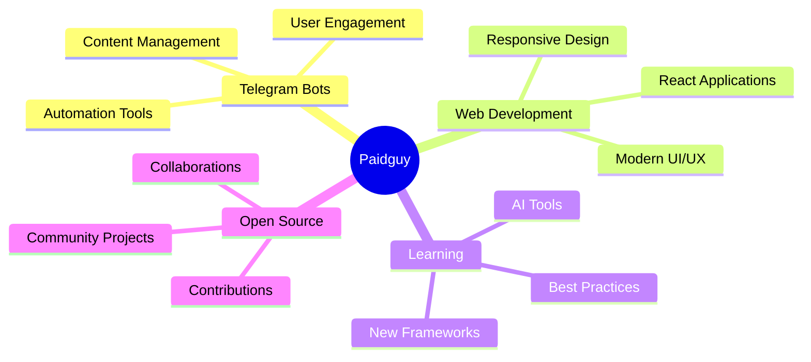

<div align="center">

#  Hey, I'm Paidguy!


</div>

---

##  About Me


- 🎓 **Student Developer** passionate about coding
- 🤖 Using **AI to supercharge** my development workflow  
- 🛠️ Building **Telegram bots**, **websites**, and **apps**
- 🌱 Always **learning** new technologies
- 💡 Creating tools that **solve real problems**
- ⚡ **AI-assisted coding** enthusiast
- 🎯 Open to **collaborations** and **fun projects**
- 🇮🇳 Based in **India**

<br clear="right"/>

---

##  Tech Stack

<div align="center">

### 💻 Languages


### 🎨 Frontend


### ⚙️ Backend & Tools


### 🤖 AI & Specialty


</div>

---

##  Featured Projects

<div align="center">

### 🚀 [Telegram Restriction Bypass](https://github.com/Paidguy/TelegramRestrictionBypass)

**Advanced tool to bypass Telegram content restrictions**

🔹 Intelligent FloodWait protection  
🔹 Multi-account rotation system  
🔹 High-speed TgCrypto processing  
🔹 Automated content downloading  

[](https://github.com/Paidguy/TelegramRestrictionBypass/stargazers)
[](https://github.com/Paidguy/TelegramRestrictionBypass/network/members)
[](https://github.com/Paidguy/TelegramRestrictionBypass/issues)
[](https://github.com/Paidguy/TelegramRestrictionBypass)

</div>

---

## 💻 Current Focus

<div align="center">

```python
class Paidguy:
    def __init__(self):
        self.name = "Paidguy"
        self.role = "Student Developer"
        self.location = "India 🇮🇳"
        self.coding_style = "AI-Assisted Development"
        
    def current_projects(self):
        return {
            "Telegram Bots": "Building powerful automation tools",
            "Web Apps": "Creating modern web applications",
            "Mobile Apps": "Developing cross-platform solutions",
            "Open Source": "Contributing to the community"
        }
    
    def tech_stack(self):
        return {
            "languages": ["Python", "JavaScript", "TypeScript", "Java"],
            "frontend": ["React", "HTML5", "CSS3", "Tailwind CSS"],
            "backend": ["Node.js"],
            "tools": ["Git", "GitHub", "VS Code"],
            "ai_tools": ["ChatGPT", "Claude"],
            "specialty": ["Telegram Bot Development"]
        }
    
    def daily_routine(self):
        activities = [
            "☕ Morning coffee + code review",
            "🚀 Building cool projects",
            "🧠 Learning new technologies",
            "🤝 Collaborating with developers",
            "🌙 Late night coding sessions"
        ]
        return activities
    
    def motto(self):
        return "Coding for fun, learning for growth, building for impact! ✨"
```

</div>

---

## 🎯 What Drives Me

<div align="center">

| 🔧 Building Tools | 🌱 Learning Tech | 🤝 Open Source | 🎨 Side Projects | 🤖 AI Coding |
|:---:|:---:|:---:|:---:|:---:|
| Solve real problems | Stay cutting-edge | Give back to community | Create for fun | Code smarter |
| Automation & bots | Latest frameworks | Contribute actively | Experiment freely | Use AI assistants |

</div>

---

## 🌟 What I'm Working On

<div align="center">



</div>

---

## 📫 Connect With Me

<div align="center">

[](https://t.me/paidguy)
[](https://x.com/imhqt)
[](https://github.com/Paidguy)

### 💬 Let's Collaborate!

I'm always interested in:
- 🤖 Building Telegram bots
- 🌐 Creating web applications  
- 📱 Developing mobile apps
- 🛠️ Automation projects
- 🎯 Learning new technologies

**Feel free to reach out on Telegram for collaborations!**

</div>

---

## 💡 Coding Philosophy

<div align="center">

> *"The best code is the code that solves real problems for real people."*

</div>

<div align="center">

### 🎨 My Development Approach

**Start with the problem** → **Leverage AI tools** → **Build iteratively** → **Share openly**

</div>

---

## 📊 Quick Stats

<div align="center">

| 📈 Metric | 📊 Value |
|:---|:---|
| 🗂️ **Public Repos** | 2+ |
| ⭐ **Total Stars** | Growing |
| 🔀 **Total Forks** | Active |
| 👥 **Followers** | Building Community |
| 🤝 **Following** | 3+ |
| 📅 **Joined GitHub** | 2023 |

</div>

---

<div align="center">


### ⚡ *"Coding for fun, learning for growth, building for impact!"* ⚡


**Thanks for visiting! Feel free to explore my repos and reach out for collaborations! 🚀**


</div>
